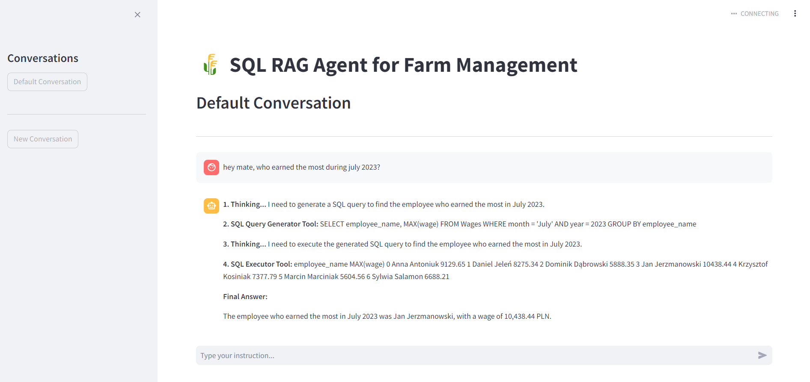

# Dzie dobry!
<br><br>

**Oto aplikacja**
# Rola

Pomoże ona wam w zarządzaniu gospodarstwem (jeśli jakieś macie).
A co najlepsze, pomoże sama.
Całkiem autonomicznie.

Zapytacie:
"Jak to możliwe?"

Odpowiedź jest prosta:
Dzięki agentom LLM.

A jak dokładnie to działa, dowiecie się w swoim czasie.



**Proces uruchomienia aplikacji**
Aby uruchomić aplikację lokalnie u siebie na komputerze, trzeba na początku sklonować to repo.
https://github.com/JakubSiwiecEpam/Rola/

Niestety zapomniałem o konfiguracji środowiska wirtualnego, więc niestety niektórych zależności może brakować :/
W razie pytań można do mnie pisać na LinkedIn:
https://www.linkedin.com/in/siwiecjakub/

Aby uruchomić, należy wykonać po kolei następujące kroki.
0. (Opcjonalnie) Postawić venv
1. Przejść do katalogu Rola:
2. Zainstalować wymadane zależności:
```
pip install -r requirements.txt
```
3. Wystartować aplikację
```
python -m streamlit run streamlit_app.py
```
4. Otworzyć http://localhost:8501/ w przeglądarce